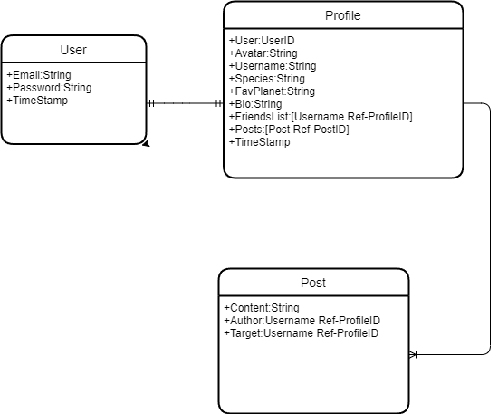
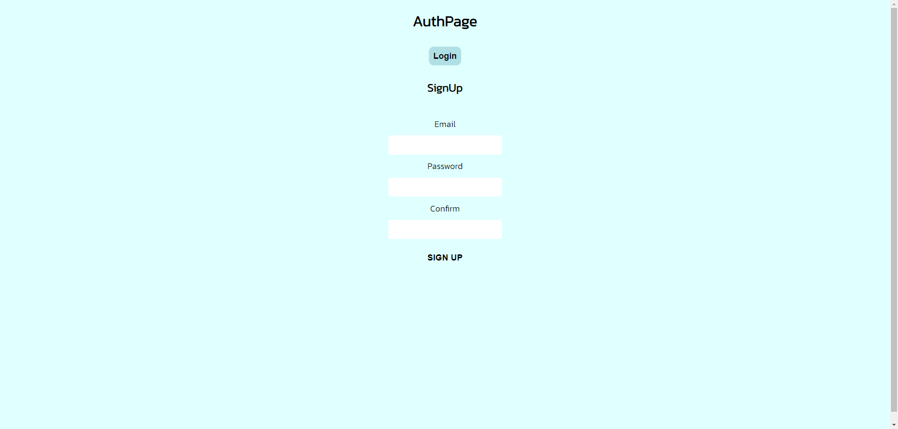
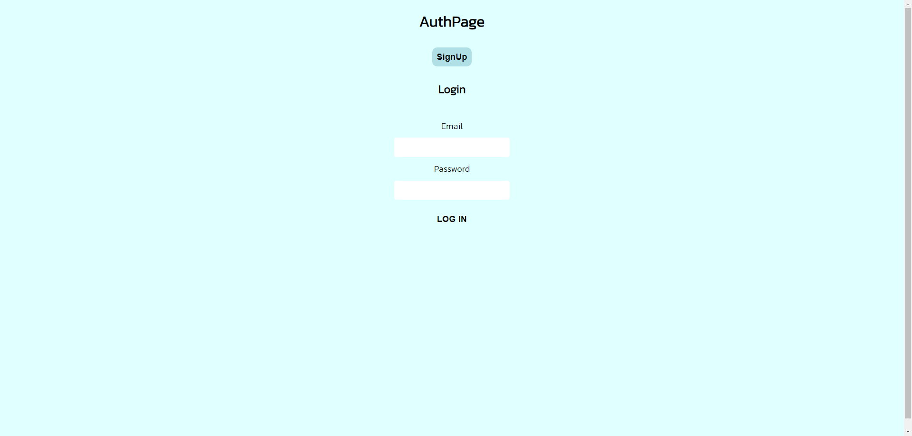
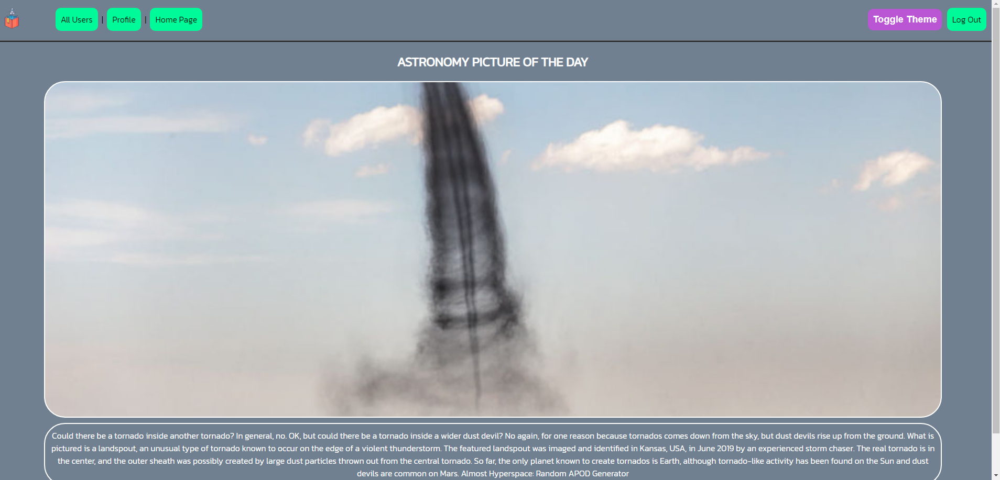
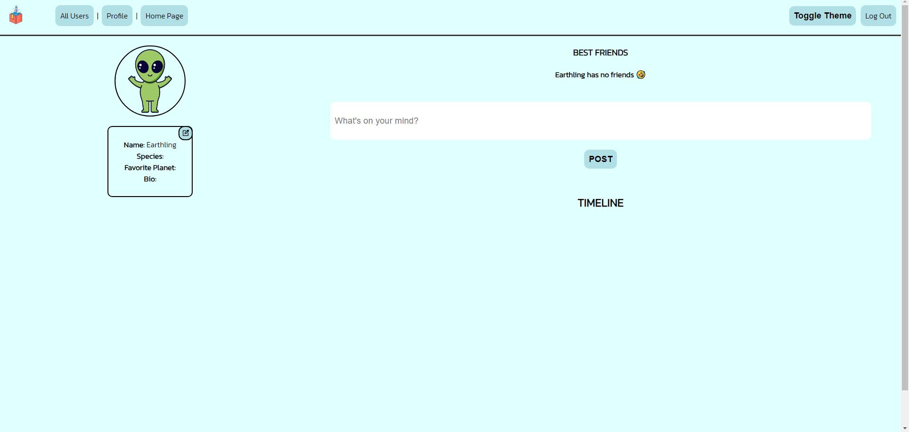
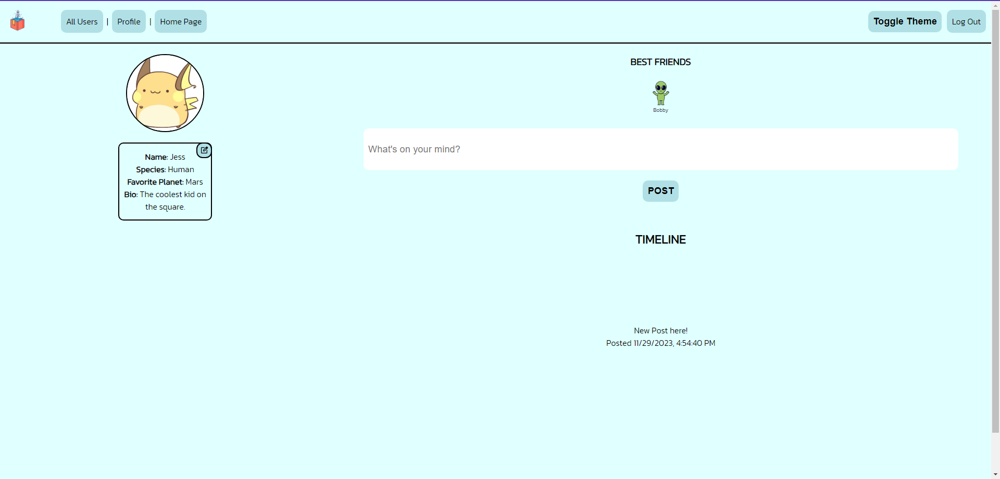
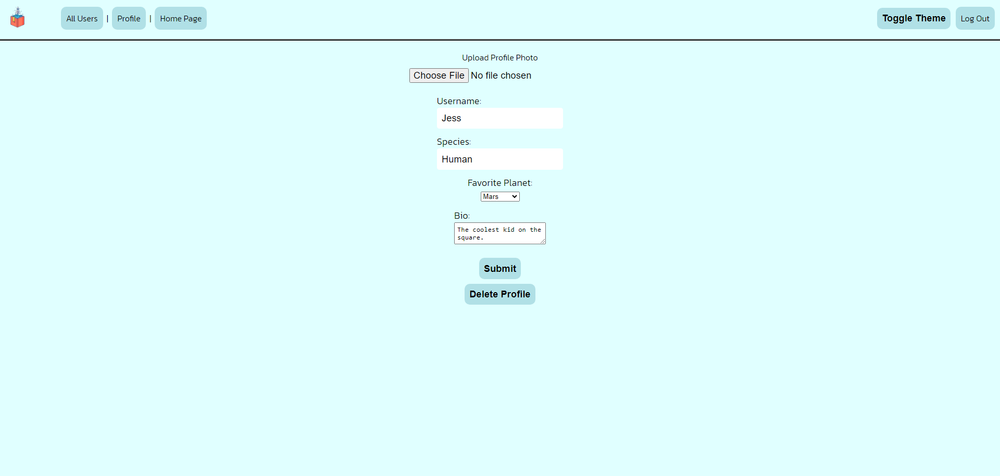
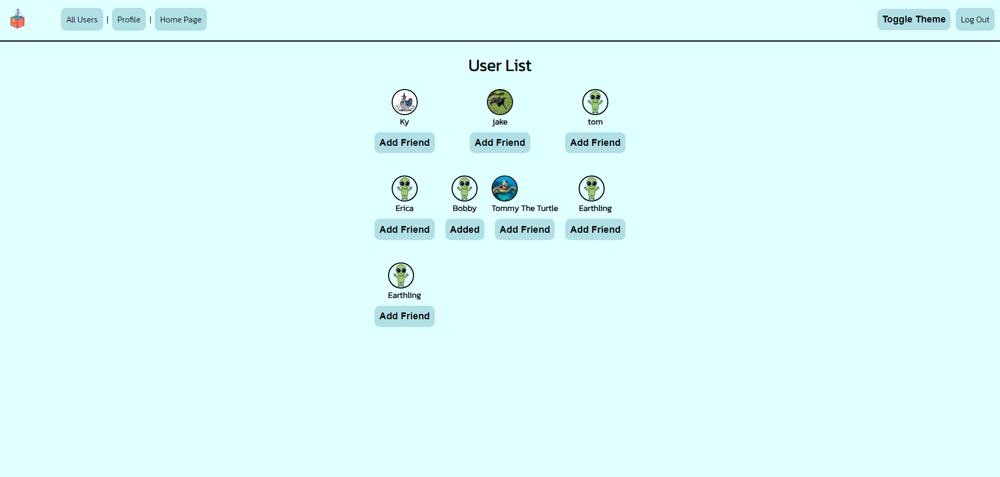

# SpaceBook

SpaceBook is an intergalactic social network. Sign up to create your profile, share your favorite planet, and connect with friends. Create posts on your page to share news, facts, or thoughts about space. You might think this app reminds of you of MySpace, but SpaceBook is out of the this world!

Visit site [here](https://space-book-5ba0b58adc3c.herokuapp.com/{:target="_blank"})

## Tech Being Used

- HTML
- CSS
- JavaScript
- Mongoose
- Express
- React
- Node.js
- NASA API

## ERD

## Restful Routing Chart

RESTful Routes
| HTTP METHOD (_Verb_) | URL (_Nouns_)       | CRUD   | Response                                   |
| -------------------- | ------------------- | ------ | ------------------------------------------ |
| `Users`              |                     |        |                                            |
| POST                 | /                   | CREATE | Create user in DB                          |
| POST                 | /login              | READ   | Check if user cred are valid               |
| `Profiles`           |                     |        |                                            |
| GET                  | /profiles/:id       | READ   | Gets active user's profile                 |
| GET                  | /profiles/:id/other | READ   | Gets the profile of another user           |
| GET                  | /profiles           | READ   | Gets all profiles                          |
| POST                 | /profiles/:id       | CREATE | Create a new profile                       |
| PUT                  | /profiles/:id       | UPDATE | Updates active user's profile              |
| DELETE               | /profiles/:id       | DELETE | Delete the user's profile                  |
| `Posts`              |                     |        |                                            |
| POST                 | /profiles/:id/posts | CREATE | Create a new post on avtive user's profile |
| GET                  | /profiles/:id/posts | READ   | Gets all posts for a profile               |
| PUT                  | /profiles/:id/posts | UPDATE | Updates user's post                        |
| DELETE               | /profiles/:id/posts | DELETE | Delete the user's post                     |
|                      |                     |        |                                            |

## Screenshots

## User Stories (AAU)

- I want to be able to login with a username and password
- I dont want to have to login more than once within a 24hr period
- I want to create a personalized profile
- I want to see who else is on the app and add friends
- I want to share super cool facts about space on my page (make a post)

## MVP Checklist

- User can create account and login.
- User can add info to and update/delete their profile.
- User can create and read posts.
- User can add friends who are also users on the app.
- User's friends list will display on their profile.
- User can see a list of all users on the app.

## Stretch Goals

1. User can upload profile picture.
2. User can search based on name through list of all users.
3. User can edit and delete their posts.
4. User can comment on friend's 'wall'.
5. User can update/delete their posts on friends' 'wall'.
6. Spotify API integration for profile song
7. User can toggle App theme colors
8. User can 'like' friends posts.
9. User can delete their friends.
10. User can sort their 'top friends'.
11. NASA API integration.

## Maybe Roadblocks

- Feature creep
- Route mix up
- Spotify API integration
- Git collaboration

## WireFrame

